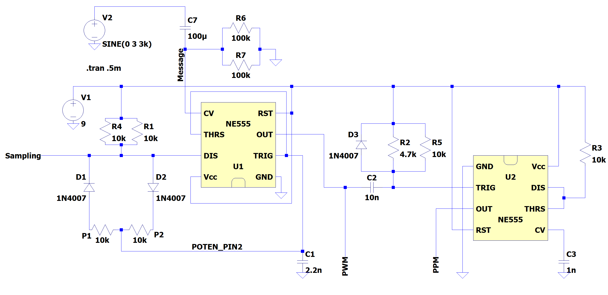
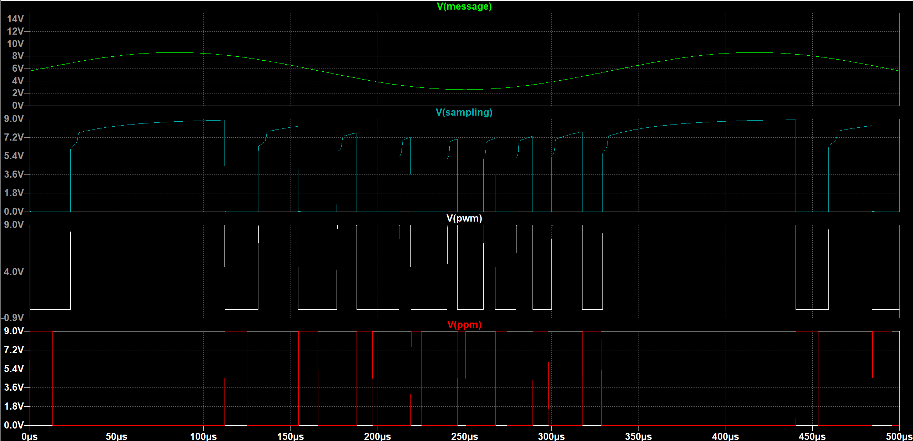
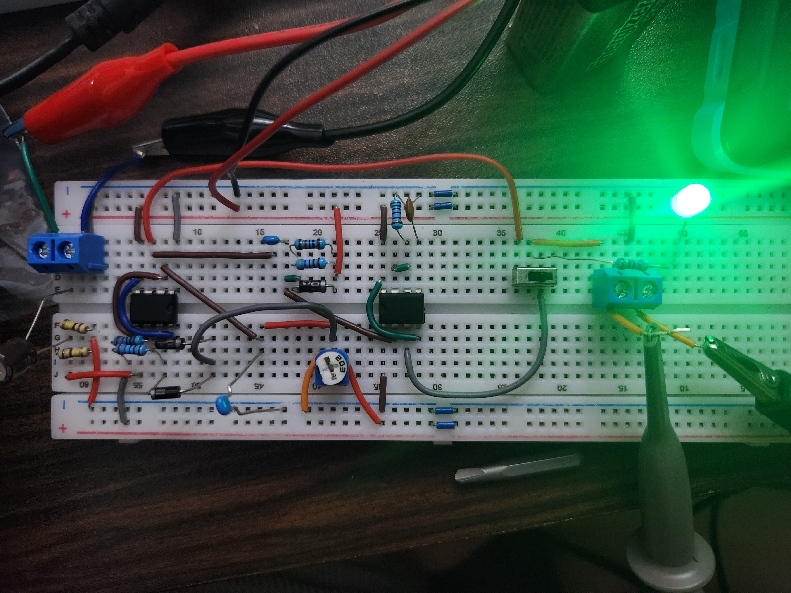
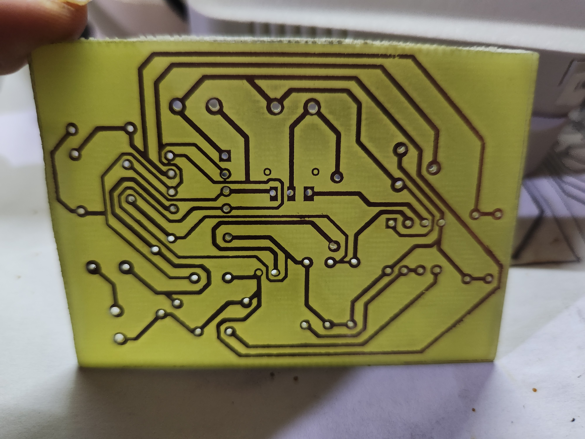
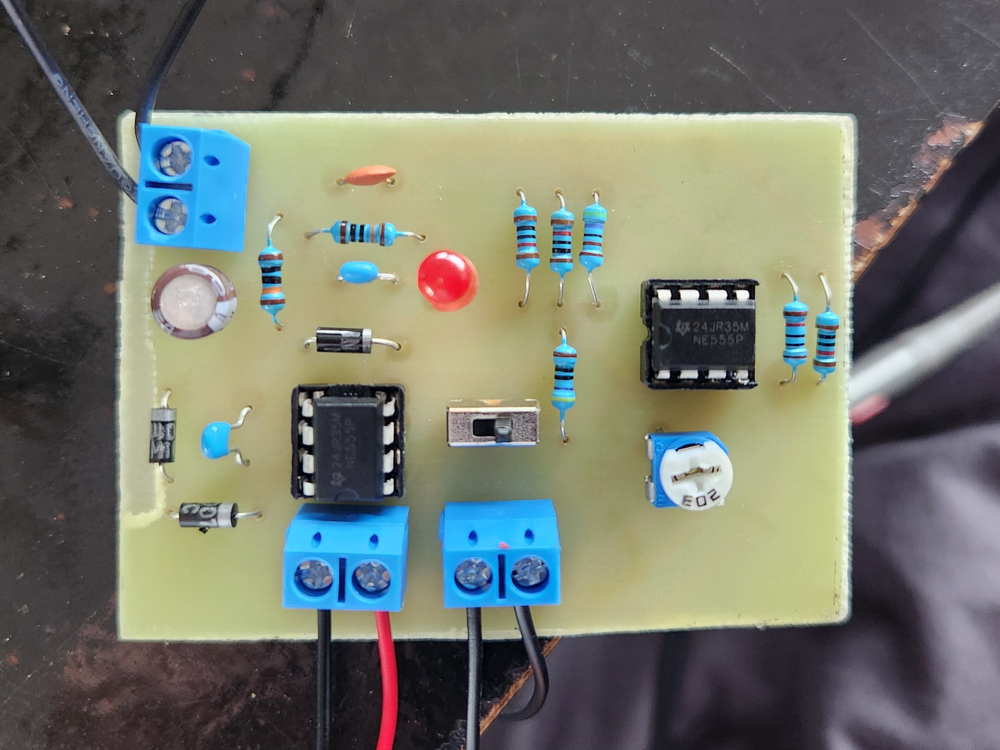
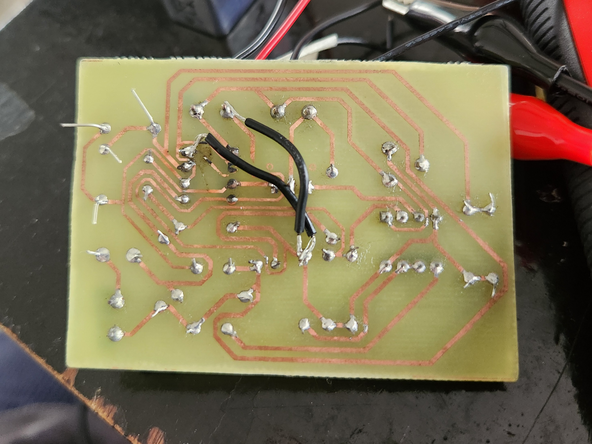
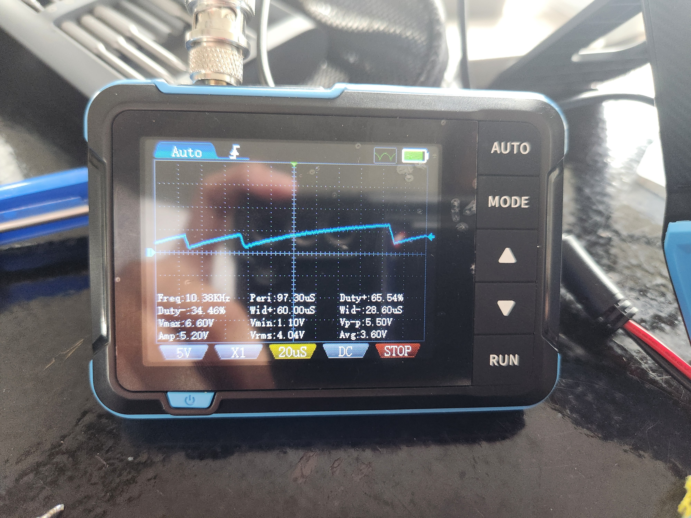
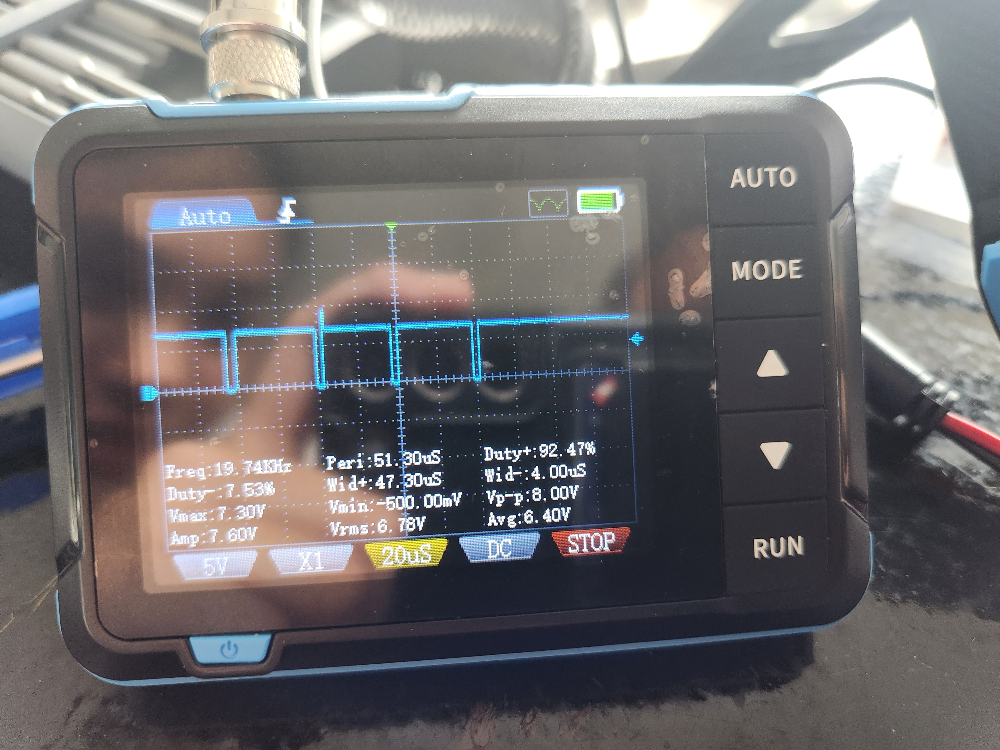
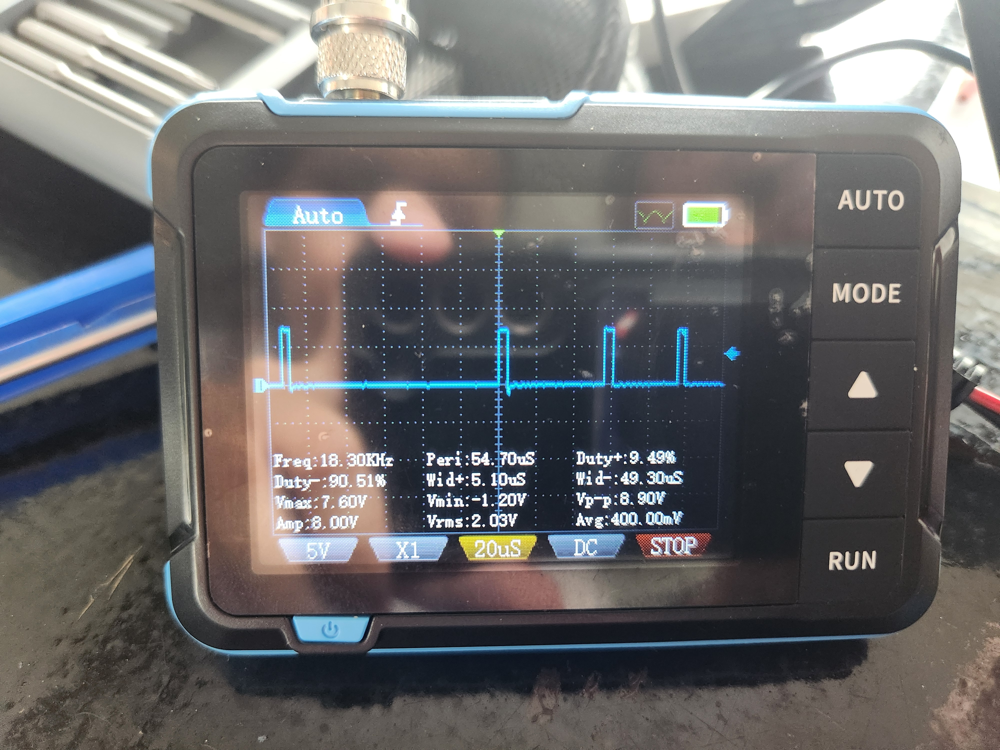

# PWM-PPM Modulation Circuit

A dual-NE555 timer circuit designed to generate Pulse Width Modulation (PWM) and Pulse Position Modulation (PPM) signals.

The project was developed through LTspice simulation, breadboard prototyping, PCB fabrication, and oscilloscope validation.

## Project Overview

The circuit uses two NE555 timer ICs to generate and process timing signals for PWM and PPM modulation.

The design was first simulated in LTspice to verify circuit behavior and waveform timing, then implemented on a breadboard before being transferred to a custom fabricated PCB.

## LTspice Simulation

### Circuit Schematic

The circuit was designed around two NE555 timer ICs. The first 555 stage generates the sampling/PWM-related timing signal, with the timing behavior adjusted through the resistor-capacitor network and potentiometer. The message signal is AC-coupled into the control-voltage path so that changes in the input waveform affect the pulse width of the generated signal.

The second 555 stage receives the timing signal from the first stage and reshapes it into a pulse-position-modulated output. Additional resistor, capacitor, and diode networks are used to control triggering, timing, and pulse shaping between the two stages.

The design was first verified in LTspice before being implemented on a breadboard and later transferred to a custom PCB.

### Simulated Waveforms

## Breadboard Prototype

## PCB Implementation

### Final Etched PCB

### Front Side

### Back Side

## Oscilloscope Validation

### Sampling Signal

### PWM Output

### PPM Output

## LTspice Simulation File

The original LTspice schematic is included in the repository for inspection and simulation.

[Open the LTspice schematic](simulation/PWM_PPM_Modulation_Circuit.asc)

## Tools Used

- LTspice
- NE555 timer ICs
- Breadboard prototyping
- Custom PCB fabrication
- Oscilloscope testing

## Status

Completed and experimentally validated.
